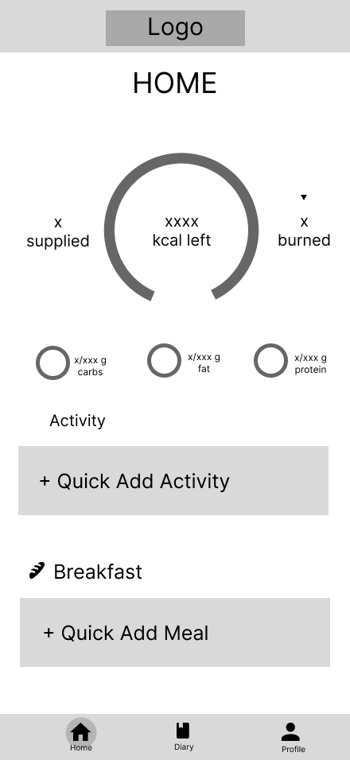
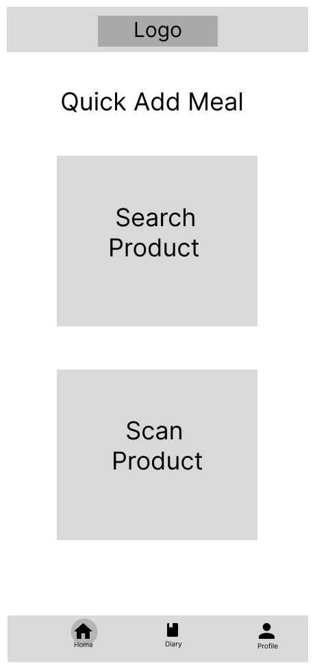
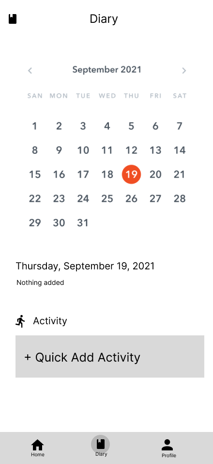

# User Experience Design

# Wideframes
### Sign up	
  

This screen is for new users to create an account. It also has a link for existing users to sign in.

### Login Page

This screen is for existing users to access their account. There's also a link to sign up for new users.

### Home

The Home screen serves as the main dashboard, displaying the user's current calorie balance and a summary of their activity and macros. It provides quick access to log both physical activities and meals.

### Add Option	

This screen is the first step in adding an item, giving the user two methods: "Search Product" for manual entry and "Scan Product" to use the camera.

### Scanned Image

This screen displays the successful result of the scan and a button to log the item immediately.

### Add Meal

This screen is used to manually search for a food product to add to their log. 

### Add Activity	

This screen allows the user to log a physical activity. It has input fields for the Name of the activity and the Activity Duration. It then calculates and displays the total calories burned before the user can log the activity.

### Diary 

This screen displays a monthly calendar where the user can view or select a specific date to check their log. 

### Daily Log View	

This screen shows the detailed daily log entries. For a specific date, it lists each meal or food item, and a breakdown of its calories, protein, fat, and carbs.

### Scanned Product Screen 

This is the review and confirmation screen after a successful product scan. It displays the food item name, brand, and a nutritional summary. Users can input the quantity and unit of the portion consumed. 

### User Profile

The User Profile screen allows the user to view and update personal data such as name, age, height, weight, and fitness settings like activity level and calorie goal. It also includes options to connect a fitness account and log out of the app.
